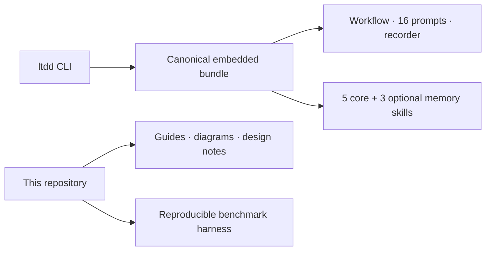

# Conductor Layered TDD

`ltdd` installs and safely updates a self-contained Microsoft Conductor workflow for taking one code-changing slice from requirements through layered TDD and human review.

## Quick path

```bash
go install github.com/cdespona/conductor-layered-tdd/cmd/ltdd@latest

cd /path/to/your/repository
ltdd install
ltdd validate

conductor run workflows/conductor/layered-tdd.yaml \
  --workspace-instructions \
  --web \
  --input request="Describe the code-changing task"
```

`ltdd` installs the workflow into the repository where it will run. Conductor itself remains a separate prerequisite.

## What is included



| Area | Location |
| --- | --- |
| Canonical install bundle | `bundle/` |
| CLI | `cmd/ltdd/` and `internal/` |
| User guide | [`docs/guide.md`](docs/guide.md) |
| Operator guide | [`docs/operator-guide.md`](docs/operator-guide.md) |
| Design history | [`docs/design-notes.md`](docs/design-notes.md) |
| Benchmark harness | [`benchmarks/layered-tdd/`](benchmarks/layered-tdd/) |

## Install and update

```bash
# Install core workflow skills into the current repository.
ltdd install

# Include Markdown memory skills.
ltdd install --memory-skills

# Target another repository.
ltdd install --target /path/to/repository

# Update files that have not been edited locally.
ltdd sync
```

The installer records hashes in `.ltdd/manifest.json`. `ltdd sync` updates only files that still match their last installed version. Divergent target files are reported as preserved. Use `--force` only when bundled content should intentionally replace local edits.

## Install the CLI

From a source checkout:

```bash
go install ./cmd/ltdd
```

After the first GitHub release:

```bash
curl -fsSL https://raw.githubusercontent.com/cdespona/conductor-layered-tdd/main/scripts/install.sh | bash
```

PowerShell users can run `scripts/install.ps1` from a checkout or download it from the same repository.

## Validate changes

```bash
GOCACHE=/tmp/ltdd-go-build go test ./...
go vet ./...

# Validate an installed target, including Conductor schema validation when available.
ltdd validate --target /path/to/repository
```

The canonical workflow exists only once under `bundle/workflows/conductor/`. Tests install from that exact embedded tree, so runnable and release assets cannot drift into separate copies.
