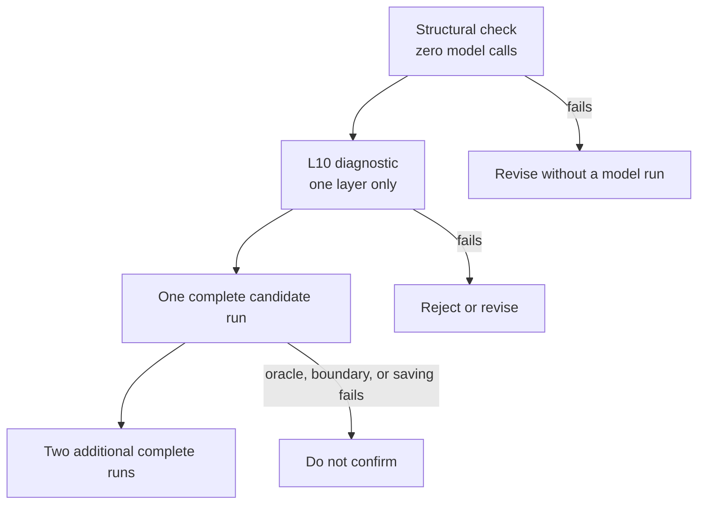
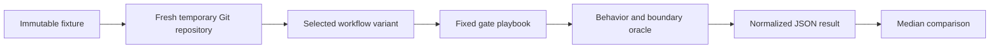

# Benchmark Layered TDD Changes Reproducibly

This benchmark materializes the same small Go project from the same Git commit for every Conductor run. It fixes the request, expected layer IDs, gate choices, verification commands, and behavioral oracle so workflow changes can be compared without confusing a shorter execution path with lower context consumption.

## Quick Path

```bash
# 1. Create a clean control project.
benchmarks/layered-tdd/scripts/materialize --variant control

# 2. Run the printed Conductor command from the generated project.

# 3. Evaluate behavior and boundaries after the run finishes.
python3 /absolute/path/to/benchmarks/layered-tdd/scripts/evaluate.py /path/to/generated/project

# 4. Convert the captured Conductor output into a comparable JSON result.
# The fixed-playbook runner also saves <run-log>.events.jsonl automatically.
python3 /absolute/path/to/benchmarks/layered-tdd/scripts/collect-results.py \
  --variant control \
  --run-log /path/to/conductor-output.txt \
  --project /path/to/generated/project \
  --output /path/to/control.json
```

## Token-Efficient Benchmark Funnel

Do not spend three complete runs on an unproven candidate. Promote a change
through the cheapest proof that can reject it:



| Tier | Purpose | Claim allowed |
| --- | --- | --- |
| Structural | Prove deterministic contracts, route counts, or payload scaling | Structural claim only |
| One-layer diagnostic | Exercise the real runtime through `L10-domain` and inspect per-agent telemetry | Diagnostic claim only |
| One full smoke | Reject behavioral, boundary, routing, or weak-saving candidates | No median claim |
| Three full candidate runs | Compare medians against a compatible frozen control baseline | End-to-end token/cost claim |

### Zero-Model Reviewer Prompt Check

For bounded-verification candidates, compare the frozen raw-stream fixture with
the canonical reviewer prompt before running Conductor:

```bash
python3 benchmarks/layered-tdd/scripts/measure-reviewer-prompt-growth.py \
  --control benchmarks/layered-tdd/testdata/raw-layer-reviewer-control.md \
  --candidate bundle/workflows/conductor/prompts/layer-reviewer.md \
  --output /path/to/prompt-growth.json
```

The script injects synthetic 1 KiB, 50 KiB, and 500 KiB payloads into every raw
verification stream reference. It succeeds only when the control still exposes
the known leak, the candidate removes all six complete stream references, and
the candidate prompt stays within the configured growth bound. This proves
prompt scaling only; it does not evaluate model quality.

### One-Layer Diagnostic

Materialize the same canonical workflow and fixed case, but stop after the real
`L10-domain` approval gate:

```bash
benchmarks/layered-tdd/scripts/materialize \
  --variant bounded-logs-diagnostic \
  --workflow /path/to/candidate/workflows/conductor \
  --noisy \
  --diagnostic-layer L10-domain

python3 benchmarks/layered-tdd/scripts/run-fixed-playbook.py \
  /path/to/generated/project \
  --run-log /path/to/bounded-logs-diagnostic.txt

python3 benchmarks/layered-tdd/scripts/evaluate.py \
  /path/to/generated/project
```

The materialized `case.json` makes the runner stop through the existing human
gate after the first reviewed layer. The evaluator automatically runs only the
domain cancellation oracle. Collected output is marked
`benchmark_scope.claim_eligible: false`, and the comparator groups it separately
from complete results.

### Frozen Control Baseline

Capture three full control runs once and reuse them across candidates only while
all compatibility fields remain unchanged:

| Frozen field | Compatibility requirement |
| --- | --- |
| Conductor | Exact version |
| Control | Exact workflow commit/tree |
| Runtime | Provider, model, and reasoning settings |
| Work | Fixture commit, request, layer IDs, and order |
| Route | Gate decisions, comments, retries, and revisions |
| Evidence | Normal/noisy mode and Graphify state |

If any field changes, refresh the control baseline. Otherwise a promising
candidate needs three candidate runs, not three new control runs plus three
candidate runs.

## Controlled Shape



The request adds idempotent order cancellation across exactly three independently reviewable layers:

| Layer | Boundary | Required result |
| --- | --- | --- |
| `L10-domain` | `internal/orders/order.go` | Define cancellation state transitions. |
| `L20-service` | Order service, repository, notifier | Persist once and notify once. |
| `L30-http` | `internal/httpapi` | Expose `POST /orders/{id}/cancel`. |

`internal/legacy` contains a plausible but forbidden cancellation implementation. It gives Graphify and repository search a realistic distractor without increasing the requested work.

## Materialize Variants

```bash
# Current workflow, normal test output.
benchmarks/layered-tdd/scripts/materialize --variant control

# Current workflow, deterministic high-volume test output.
benchmarks/layered-tdd/scripts/materialize --variant control-noisy --noisy

# One-layer diagnostic; never eligible for an end-to-end claim.
benchmarks/layered-tdd/scripts/materialize \
  --variant control-noisy-diagnostic \
  --noisy \
  --diagnostic-layer L10-domain

# Workflow from another directory.
benchmarks/layered-tdd/scripts/materialize \
  --variant bounded-logs \
  --workflow /path/to/candidate/workflows/conductor \
  --noisy

# Build a focused code-only Graphify graph before the run.
benchmarks/layered-tdd/scripts/materialize --variant graphify --graphify
```

The materializer never overwrites an existing directory. With no `--destination`, it creates a new directory under `${TMPDIR:-/tmp}` and prints both its path and the exact Conductor command.

## Fixed Gate Playbook

Follow [cases/idempotent-cancellation/gates.md](cases/idempotent-cancellation/gates.md) exactly. In particular:

1. Use the graph decision associated with the variant.
2. Approve the generated requirements without revision.
3. Select `L10-domain`, `L20-service`, and `L30-http` in that order.
4. Have the agent author each approved top-level test.
5. Confirm expected red evidence, approve each completed layer, and skip memory capture.

If an agent creates different layers or a gate needs an unplanned revision, retain the run but mark it non-comparable in the result notes.

For repeatable terminal runs, the playbook can be driven automatically after
materialization:

```bash
python3 /absolute/path/to/benchmarks/layered-tdd/scripts/run-fixed-playbook.py \
  /path/to/generated/project \
  --run-log /path/to/conductor-output.txt
```

The runner waits for each named gate and provides its text field separately. It
fails instead of guessing when the workflow reaches an unexpected revision or
checkpoint route. It assigns a unique Conductor run ID and copies the runtime's
authoritative event log beside the requested run log as
`<run-log>.events.jsonl`.

## Verification Modes

| Mode | Test command | Purpose |
| --- | --- | --- |
| Normal | `make test` | Measures ordinary workflow context. |
| Noisy | `make test-noisy` | Produces deterministic verbose output to expose log-injection costs. |

Both modes execute the same tests. Noisy mode changes output volume, not behavior.

## Result Schema

`collect-results.py` extracts:

- input, output, and total tokens;
- total cost and cost by agent;
- model invocation count;
- tokens and cost per invocation;
- expected layer count;
- Git change size;
- oracle and boundary results when evaluation has run.
- benchmark scope, attempted layers, and whether the result is eligible for an
  end-to-end claim.

When the adjacent Conductor `.events.jsonl` file is available, it also records:

- one entry per model invocation with agent, iteration, selected layer, model,
  reasoning effort, elapsed time, input/output/total tokens, and cost;
- rendered-prompt bytes and captured tool argument/output bytes without copying
  their contents into the result;
- tool-call counts and names, truncation counts, script stdout/stderr bytes,
  human-gate routes, and retry events;
- aggregate telemetry by agent and by layer;
- reconciliation between the terminal token summary and event totals;
- an availability map that leaves cache, reasoning, artifact, or Graphify
  metrics unavailable when Conductor does not emit authoritative values.

The collector auto-discovers `<run-log>.events.jsonl`. For an independently
captured runtime log, pass it explicitly:

```bash
python3 benchmarks/layered-tdd/scripts/collect-results.py \
  --variant candidate \
  --run-log /path/to/conductor-output.txt \
  --events-log /path/to/conductor-layered-tdd.events.jsonl \
  --project /path/to/generated/project \
  --output /path/to/candidate.json
```

Useful focused views:

```bash
# Every model call, including its active layer and payload sizes.
jq '.telemetry.model_invocations[] |
  {agent, layer_id, tokens, prompt_bytes, tool_calls, tool_output_bytes}' result.json

# Reviewer medians for one collected run.
jq '.telemetry.by_agent.layer_reviewer' result.json

# Fields the installed Conductor/provider did not report.
jq '.telemetry | {status, coverage, unavailable_fields}' result.json
```

Compare any number of collected results:

```bash
python3 benchmarks/layered-tdd/scripts/compare-results.py \
  /path/to/control-1.json \
  /path/to/control-2.json \
  /path/to/candidate-1.json
```

Use at least three completed full runs per promoted variant and compare medians.
A structural check, one-layer diagnostic, or one complete smoke can reject a
broken or weak candidate, but none is sufficient to claim an end-to-end token
improvement.

`compare-results.py` prints the overall median table followed by per-agent and
per-layer telemetry median tables whenever event telemetry is present. This is
the primary view for checking whether noisy output increased
`layer_reviewer` input tokens or whether a candidate reduced only unrelated
calls.

## Fairness Checklist

- [ ] Same fixture commit and case request.
- [ ] Same model and reasoning settings.
- [ ] Same layer IDs and order.
- [ ] Same gate decisions and comments.
- [ ] Same normal/noisy verification mode.
- [ ] Same Graphify state at run start.
- [ ] Oracle passes and forbidden boundaries remain untouched.
- [ ] Revision or retry deviations are recorded.
