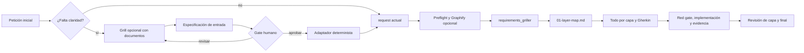

# Plan de mejora del preflujo de entrada

## Objetivo

Añadir, antes del flujo actual, un preflujo **opcional** que convierta una petición ambigua en una especificación de entrada breve, revisable y estable. El cambio debe mejorar la calidad del input sin sustituir el núcleo existente: requisitos, selección de una sola slice, mapa y todos por capas, TDD, gates humanos y evidencia verificable.

| Se conserva como autoridad | Mejora propuesta |
| --- | --- |
| `bundle/workflows/conductor/layered-tdd.yaml` y sus prompts | Preparar una entrada canónica antes de `requirements_griller` |
| `00-requirements.md`, `01-layer-map.md` y `layers/*.todo.md` | Reducir ambigüedad y retrabajo al generarlos |
| `context.mode: explicit` | Entregar solo la especificación y sus fuentes, no el diálogo completo |
| Decisiones humanas y `## Decision Log` | Añadir un gate de aprobación del input cuando se active el preflujo |

## Arquitectura propuesta



El grill se inspira en `grill-with-docs`: pregunta solo para resolver ambigüedades, vocabulario, decisiones y límites, citando los documentos usados. La síntesis se inspira en `to-spec`: fija el contrato acordado, no propone una implementación extensa. Un adaptador determinista valida y proyecta ese contrato al `request` y al contexto explícito que ya consume Conductor.

### Responsabilidades y límites

| Componente | Responsabilidad | No debe hacer |
| --- | --- | --- |
| Grill documental | Detectar términos ambiguos, contradicciones, decisiones faltantes y límites | Diseñar capas, escribir código o decidir por el humano |
| Sintetizador | Producir una especificación mínima y trazable | Crear tickets o duplicar `00-requirements.md` |
| Gate de entrada | Aprobar, revisar o abandonar el preflujo | Reemplazar gates posteriores |
| Adaptador determinista | Validar esquema y generar una proyección estable para `request` | Inferir hechos ausentes o cambiar decisiones |
| Flujo existente | Descubrir el repositorio, seleccionar slice y ejecutar TDD por capas | Depender del historial completo del grill |

## Contrato mínimo de entrada

Formato conceptual inicial; antes de implementarlo debe fijarse como esquema versionado y validable.

```yaml
schema_version: 1
goal: "Resultado observable que se busca"
problem: "Problema o necesidad que lo motiva"
vocabulary:
  term: "Definición acordada"
scope:
  in:
    - "Comportamiento incluido"
  out:
    - "Límite explícito"
acceptance_criteria:
  - id: AC-01
    given: "Estado inicial"
    when: "Acción"
    then: "Resultado observable"
constraints:
  - "Restricción técnica, de producto o proceso"
test_strategy:
  observable_level: "Nivel superior donde probar el comportamiento"
  required_evidence:
    - "Evidencia que debe conservarse"
decisions:
  - question: "Alternativa relevante"
    choice: "Elección humana"
    rationale: "Motivo breve"
assumptions:
  - statement: "Supuesto no bloqueante"
    validation: "Cómo comprobarlo"
open_blockers: []
sources:
  - path: "Ruta o referencia examinada"
```

Reglas del contrato:

- `goal`, `scope.in`, `scope.out` y al menos un criterio de aceptación son obligatorios.
- `open_blockers` debe estar vacío para aprobar; la ausencia de información no se convierte en supuesto silencioso.
- Los criterios describen comportamiento observable, no tareas ni capas.
- `test_strategy` expresa nivel de observación y evidencia; `layer_todo_generator` conserva la autoridad sobre Gherkin concreto, ownership y red-test gate.
- El adaptador genera una representación textual estable para `workflow.input.request` y, si se añade un nuevo input como `input_spec_path`, pasa la ruta explícitamente solo a los consumidores necesarios.
- La especificación aprobada es inmutable durante una ejecución; cualquier cambio semántico vuelve al gate de entrada o queda registrado en los gates actuales.

## Reglas de activación

| Situación | Ruta |
| --- | --- |
| Petición pequeña, vocabulario conocido, límites y aceptación explícitos | Omitir preflujo; mantener compatibilidad con `--input request=...` |
| Ambigüedad que cambia comportamiento, alcance, datos, actor o criterio de aceptación | Activar grill y gate de entrada |
| Documentos de referencia con posibles contradicciones | Activar grill documental y registrar fuentes/conflictos |
| Iniciativa grande y todavía incierta, sin una slice seleccionable | Usar Wayfinder antes del preflujo; regresar cuando exista una iniciativa acotada |
| Necesidad de dividir trabajo ya entendido | No usar `to-tickets` al inicio; `requirements_griller`, `slice-selection.md` y `01-layer-map.md` ya realizan la descomposición adecuada |
| Implementación completada | `code-review` puede añadirse después como complemento opcional, sin sustituir `layer_reviewer` ni `99-final-review.md` |

El modo debe ser explícito (`off`, `auto` o `required`), con `off` compatible con el comportamiento actual. En `auto`, reglas deterministas detectan señales de ambigüedad y el humano confirma la activación; el modelo no decide silenciosamente ampliar el proceso.

## Fases priorizadas

| Prioridad | Fase | Entregables | Salida verificable |
| ---: | --- | --- | --- |
| P0 | Fijar contrato y fixtures | Esquema v1, ejemplos válidos/inválidos y reglas de proyección | La misma especificación produce exactamente el mismo input adaptado |
| P1 | Prototipo fuera del workflow | Grill, síntesis y validador ejecutables sobre fixtures | Ningún cambio en `bundle/workflows/conductor/`; revisión humana de calidad |
| P2 | Integración mínima y compatible | Inputs de modo/ruta, gate opcional y adaptador antes del núcleo | `request` directo sigue recorriendo la ruta actual; la spec aprobada llega a `requirements_griller` |
| P3 | Propagación explícita | Proyecciones mínimas para requisitos, mapa de capas y todos | Sin transcript replay ni nueva fuente de verdad mantenida a mano |
| P4 | Benchmark y endurecimiento | Variantes control/preflujo, telemetría, casos de fallo y documentación | Oráculo y límites pasan; mediana de al menos tres ejecuciones comparables |
| P5 | Complementos | Evaluar Wayfinder y revisión de código como rutas externas opcionales | Cada complemento demuestra valor sin cambiar gates ni artefactos autoritativos |

Cada fase que altere workflow, prompt, recorder, installer o skill debe cumplir la validación del repositorio: `go test ./...` con `GOCACHE=/tmp/ltdd-go-build`, instalación temporal con `--memory-skills`, comparación contra `bundle/workflows/conductor/`, `conductor validate` cuando esté disponible y `git diff --check`.

## Criterios de éxito y medición

| Dimensión | Indicador | Umbral inicial |
| --- | --- | --- |
| Calidad de entrada | Blockers nuevos descubiertos después de aprobar requisitos | Menos que el control; objetivo inicial: reducción de 30 % |
| Estabilidad | Revisiones de requisitos/mapa causadas por ambigüedad de entrada | Mediana menor que el control |
| Fidelidad | Criterios aprobados trazables a `00-requirements.md` y a uno o más todos | 100 %, sin contradicciones |
| Compatibilidad | Ruta con `request` directo | Mismo comportamiento, gates y artefactos que el control |
| Seguridad del proceso | Implementación iniciada con blockers abiertos | 0 casos |
| Eficiencia | Tokens, coste, invocaciones y tiempo hasta requisitos aprobados y hasta final | Reportar delta; no aceptar ahorro con peor oráculo o límites |
| Determinismo | Variación del adaptador sobre el mismo input | 0 diferencias semánticas y salida byte a byte estable cuando sea viable |
| Valor neto | Tareas complejas terminadas sin revisión adicional frente al coste del preflujo | Mejora medible en tareas ambiguas; sobrecoste acotado en tareas claras |

Extender el harness de `benchmarks/layered-tdd/`: añadir casos gemelos claro/ambiguo, mantener fixture, gates, modelos, comandos y Graphify constantes, evaluar con el oráculo y comparar medianas de tres ejecuciones exitosas por variante. Medir el preflujo por separado evita atribuirle costes del núcleo.

## Riesgos y decisiones abiertas

| Riesgo o decisión | Tratamiento propuesto | Decidir antes de |
| --- | --- | --- |
| Duplicación entre especificación y `00-requirements.md` | Spec = entrada aprobada; `00-requirements.md` = contrato contextualizado al repositorio | P2 |
| Deriva entre spec, request adaptado y artefactos | Hash/versionado, proyección determinista y trazabilidad por ids de aceptación | P2 |
| Grill interminable o demasiado costoso | Presupuesto de rondas, preguntar solo por decisiones bloqueantes y permitir abandonar | P1 |
| Activación automática impredecible | Heurísticas visibles y gate humano; definir señales y precedencia de `off/auto/required` | P1 |
| Documentos obsoletos o contradictorios | Registrar fuente, vigencia y conflicto; no promoverlos a verdad | P1 |
| Estrategia de pruebas demasiado prescriptiva | Limitarla al nivel observable y evidencia; dejar seams, ownership y Gherkin al flujo | P0 |
| Persistencia y ubicación de la spec | Preferir un artefacto junto al plan activo o una ruta explícita; decidir nombre, lifecycle y resume | P2 |
| Reapertura tras cambiar la spec | Definir si crea nueva ejecución o invalida artefactos posteriores; nunca mutarlos silenciosamente | P2 |
| Wayfinder y code-review aumentan rutas | Mantenerlos externos y opt-in hasta demostrar demanda y métricas propias | P5 |

## Decisión de alcance actual

Primero validar el contrato y el adaptador con fixtures. No incorporar aún Wayfinder, `to-tickets` ni `code-review`; tampoco modificar el flujo canónico hasta demostrar que la especificación reduce ambigüedad sin duplicar la descomposición por capas ni debilitar TDD, gates o evidencia.
