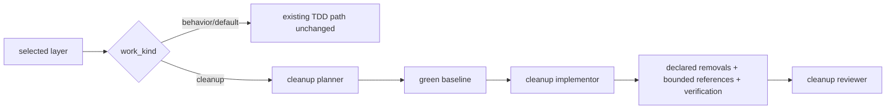
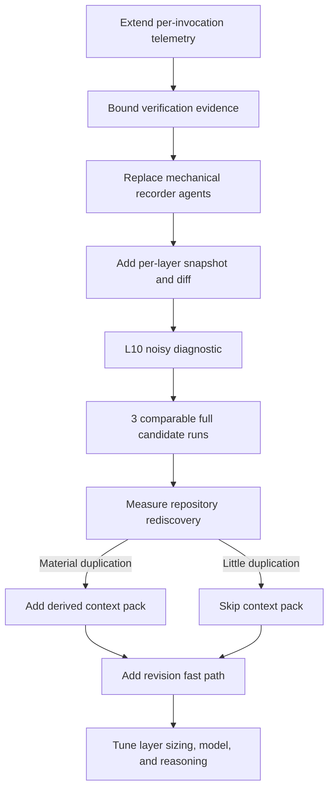
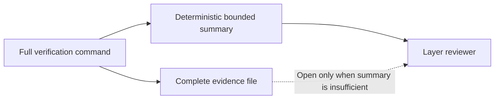
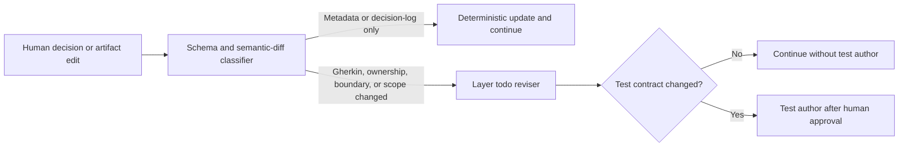
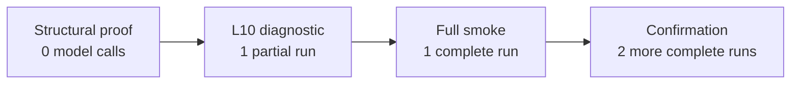
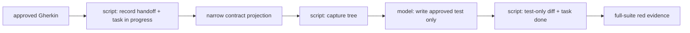

# Next Improvements

This document is the cross-session backlog for reducing token consumption and
cost in the Conductor layered-TDD workflow without weakening its behavioral,
boundary, or human-approval guarantees.

## Working Rules

| Rule | Meaning |
| --- | --- |
| Canonical workflow | `bundle/workflows/conductor/` is the only workflow source of truth. |
| Preserve explicit context | Keep `context.mode: explicit`; pass bounded, authoritative artifacts instead of replaying the accumulated transcript. |
| Measure comparable routes | Hold the fixture, layer map, layer order, gates, retries, model, reasoning, and Graphify state constant. |
| Preserve judgment | Keep requirements, design, test authoring, implementation, and review as model tasks where judgment is required. |
| Mechanize state transitions | Prefer scripts or `type: set` for schema validation, summaries, frontmatter changes, decision-log rows, and routing state. |
| Keep complete evidence | Store complete command output in evidence files even when models receive only summaries. |
| Require behavioral proof | A candidate is acceptable only when the oracle passes and forbidden boundaries remain untouched. |
| Compare medians | Use at least three successful comparable runs per promising variant. One run can reject a broken variant but cannot establish savings. |

## Current Conclusion

The highest-value direction is to optimize the deterministic happy path before
optimizing exceptional revision paths.

## Cleanup-Specific Route

Status: implemented and locally validated 2026-09-04. The Go suite, 39 Python
structural/unit tests, temporary installation parity, Conductor validation, and
`git diff --check` passed. No token-savings claim is made until a requested,
comparable benchmark is run.

The workflow now distinguishes `work_kind: behavior|cleanup` per layer. Missing
classification remains `behavior`, so existing maps keep the current path.
Cleanup can use any layer id and appear wherever its dependencies permit.



| Cleanup invariant | Enforcement |
| --- | --- |
| Replacement is active and consumers migrated. | Cleanup-plan contract plus human approval; incomplete plans cannot reach implementation. |
| Observable behavior is already protected. | Existing behavior tests are the preservation contract; baseline and post-cleanup suites must be green. |
| No egg-and-chicken absence tests. | Cleanup prompts prohibit permanent tests asserting an old private implementation is unused or absent. |
| Obsolete implementation-coupled tests may leave with obsolete code. | They must be named removal targets; behavior-oriented tests remain. |
| Deletion is exact and bounded. | Repository-relative removal inventory, fixed-string reference patterns/roots, layer snapshot/diff, and boundary checks. |
| Ambiguous or mixed work is not cleanup. | Mapper defaults it to behavior or splits a prerequisite behavior/test-hardening layer. |
| Public/data/event/cross-release retirement is excluded. | Route it as behavior/migration work with its own contract. |

Expected happy-path model calls for a cleanup layer are three: cleanup planner,
cleanup implementor, and cleanup reviewer. Baseline, verification, routing,
snapshot/diff, and exact removal/reference checks are deterministic steps.



## Ranked Backlog

| Rank | Change | Confidence | Expected effect | Main risk |
| ---: | --- | --- | --- | --- |
| 1 | Bound verification evidence | Implemented; L10 noisy diagnostic passed 2026-09-03 | Large input-token reduction, especially with noisy commands | Hiding a failure detail needed for review |
| 2 | Replace always-on mechanical recorders with scripts | Implemented; L10 noisy diagnostic passed 2026-09-03 | Remove two model calls from the common agent-authored-test route | Incorrect gate-field or artifact mutation contract |
| 3 | Extend per-invocation telemetry | Implemented 2026-08-04 | Explain where tokens and tool output are consumed | Runtime logs may not expose every desired field |
| 4 | Review a per-layer snapshot and patch | Implemented; L10 noisy path exercised 2026-09-03 | Prevent cumulative earlier-layer changes from entering later reviews | Incorrect snapshot semantics for uncommitted changes |
| 5 | Add a deterministic revision fast path | Route-dependent | Avoid semantic reviser/test-author calls for metadata-only changes | Misclassifying a contract change as mechanical |
| 6 | Add a derived layer context pack | Implemented; contract-preserving L10 rerun passed 2026-09-03 | Reduce repeated repository and artifact discovery | Duplicated, stale, or weakened contract state |
| 7 | Prevent unnecessary micro-layers | Valid but risky | Avoid a full layer call cycle | Merging real architectural or test boundaries |
| 8 | Route suitable tasks to cheaper models/reasoning | Secondary | Reduce cost and reasoning tokens | Lower-quality semantic decisions |

## Confirmed Leak: Verification Output

Before the 2026-09-03 bounded-evidence implementation, the canonical workflow
passed complete output streams to `layer_reviewer`:

- `verification_tests.output.stdout`
- `verification_tests.output.stderr`
- `verification_lint.output.stdout`
- `verification_lint.output.stderr`
- `verification_security.output.stdout`
- `verification_security.output.stderr`

`bundle/workflows/conductor/prompts/layer-reviewer.md` then expands all six
streams inline. The workflow uses explicit context, so this is not accidental
global accumulation: these large values are explicitly injected into the
reviewer call.

There is a second consumption point. The red-suite command stores complete
output in an evidence file, but `red_suite_evidence_recorder` is instructed to
open that file and summarize it. A noisy full-suite result may therefore be
consumed once by the recorder and later again through inline reviewer output.

### Target Contract

Keep running the complete test, lint, and security commands. For each command,
persist the complete output and produce a deterministic summary containing:

```yaml
command: make test
exit_code: 1
duration_ms: 1842
passed_count: 38
failed_count: 2
failed_test_names:
  - TestCancelAlreadyCancelled
  - TestCancelNotFound
bounded_excerpt: |-
  ...bounded failure-focused output...
evidence_path: /tmp/conductor-verification-tests.XXXXXX
output_bytes: 51234
excerpt_bytes: 2048
summary_truncated: true
```

Parsers must tolerate tools that cannot provide reliable pass/fail counts. In
that case, use `null` or an explicit `unavailable` state rather than guessing.



### Acceptance Criteria

- The complete command still executes.
- Complete stdout and stderr remain available at an evidence path.
- The reviewer input does not contain complete verification streams.
- Excerpts are bounded by bytes or lines and prefer failure-relevant content.
- Exit code and command remain exact.
- The reviewer can report that evidence was truncated.
- Normal and noisy benchmark variants produce the same behavioral result.
- Increasing raw log volume beyond the excerpt bound does not materially
  increase reviewer input tokens.

## Confirmed Opportunity: Mechanical Model Calls

Before the script replacements, the benchmark's normal agent-authored-test
route used six model calls before human layer approval:

| Call | Current model/reasoning | Judgment required | Candidate treatment |
| --- | --- | --- | --- |
| `layer_todo_generator` | Full model, high | Yes | Keep model-backed |
| `agent_test_author` | Full model, high | Yes | Keep model-backed |
| `red_suite_evidence_recorder` | Mini, low | Mostly mechanical | Replace with script |
| `red_gate_decision_recorder` | Mini, low | Mechanical | Replace with script |
| `implementor` | Full model, workflow default | Yes | Keep model-backed |
| `layer_reviewer` | Full model, high | Yes | Keep model-backed; reduce its inputs |

The exact call count depends on the route:

| Route | Calls before layer approval | Notes |
| --- | ---: | --- |
| Agent authors approved test | 6 | Includes two mini recorder calls. |
| Existing top-level test | 5 | Skips `agent_test_author`. |
| One todo revision, then agent test | 7 | Adds one reviser call. |
| Repeated revision | +1 each cycle | Test author repeats only if that route is chosen again. |

Therefore, "every extra layer creates at least six calls" is too broad. Five is
the current minimum on the existing-test path; six applies to the fixed
benchmark playbook.

### Recorder Replacement Order

1. Make the verification script emit bounded structured evidence.
2. Replace `red_suite_evidence_recorder` with a deterministic artifact updater.
3. Replace `red_gate_decision_recorder` with a deterministic decision updater.
4. Validate actual human-gate output paths against the installed Conductor
   runtime and a real `gate_resolved` event.
5. Add runtime-shaped regression tests for nested `additional_input` fields and
   selected options.

Gate fields are route- and Conductor-version-sensitive. Do not assume a
`prompt_for` field is flattened into `gate.output.<field>`; inspect the runtime
contract before wiring it into a script.

The 2026-09-03 L10 diagnostic confirmed that Conductor v0.1.34 emits optional
gate text under `additional_input.feedback`. Both recorders executed as scripts,
so neither produced a model invocation.

## Per-Layer Context Pack

A small authoritative context pack could reduce repeated discovery, but it
must not become a second human-maintained source of truth. The selected layer
todo already contains the Gherkin, boundaries, ownership, gate state, task
board, risks, and decision log.

Prefer a deterministic pack derived from `01-layer-map.md`, the selected todo,
and verified repository state:

```yaml
layer: L20-service
todo: .github/plans/example/layers/L20-service.todo.md
production_files:
  - internal/orders/service.go
test_files:
  - internal/orders/service_test.go
symbols:
  - Service.Cancel
allowed_paths:
  - internal/orders/
forbidden_paths:
  - internal/legacy/
verified_graph_locations: []
layer_snapshot: "<working-tree snapshot identifier>"
```

### Agent Projections

| Consumer | Minimum projection |
| --- | --- |
| Test author | Behavior contract, approved test files, production read-only rule |
| Implementor | Behavior contract, production files, allowed/forbidden paths, test ownership |
| Reviewer | Contract, verification summary, layer-only patch, boundary violations |
| Next-layer selection | Layer-map state and compact completed-layer result |

### Decision Gate

The 2026-09-03 L10 diagnostic showed that the todo generator, test author, and
implementor were the three largest layer consumers, so the derived projections
are now implemented for those agents. The reviewer already has its separate
bounded evidence and layer-patch projection.

Implementation rules:

- generate it mechanically;
- make the map and todo authoritative;
- record source artifact paths and hashes;
- regenerate rather than manually revise it;
- fail closed when the pack is stale;
- keep Graphify locations as navigation evidence, not proof.

The projection is regenerated for each consumer with a source fingerprint and
per-file hashes. Source excerpts are capped at 12 KB for the todo generator,
16 KB for the test author, and 20 KB for the implementor. Forbidden paths are
excluded; map and todo artifacts remain authoritative.

Graphify queries should remain bounded to approximately 400-800 tokens. Agents
must open and verify returned source locations. A graph must not be rebuilt from
inside a model prompt.

## Layer-Specific Diff

The reviewer should inspect only changes introduced by the active layer.
Comparing against the repository's initial `baseline_commit` is insufficient
when previous layers remain uncommitted or multiple layers edit the same file.

Capture a working-tree snapshot immediately before implementation and compute a
delta against that exact state afterward. Possible implementations include a
temporary Git index/tree or a deterministic file-content hash snapshot.

The reviewer should receive:

- files added, modified, and deleted in this layer;
- bounded textual patch;
- path to the complete patch;
- boundary classification per changed file;
- explicit detection of changes outside allowed paths;
- snapshot identity and capture time.

### Acceptance Criteria

- Earlier-layer changes do not appear in the active layer patch.
- A second layer changing the same file shows only its own delta.
- Added, deleted, renamed, and binary files are represented safely.
- Boundary violations are detected deterministically.
- The complete patch remains available without being injected by default.

## Deterministic Revision Fast Path

Revision optimization is useful but should follow happy-path optimization
because the fixed comparable benchmark intentionally performs no revisions.



### Mechanical Changes

- Formatting that does not change parsed values.
- Decision-log append using an already-resolved gate decision.
- Frontmatter synchronization whose new value is mechanically implied by that
  decision.
- Dashboard synchronization with no Gherkin, ownership, scope, or test-boundary
  change.

### Semantic Changes

- Gherkin or equivalent behavior changes.
- Test ownership changes.
- Test file or test seam changes.
- Allowed or forbidden boundary changes.
- Selected layer or dependency changes.
- New behavior, contradiction, waiver rationale, or scope expansion.
- Free-text feedback that cannot be mapped to an existing deterministic action.

The classifier must fail closed: ambiguous changes go to the semantic reviser.
A test-author call should repeat only after a changed test contract is approved.

## Micro-Layer Policy

Every layer adds a complete test/verification/review cycle, but layers are also
the workflow's architectural and risk boundaries. Do not merge layers solely to
reduce token counts.

Potential mapper heuristics to investigate:

- Reject layers that contain only a trivial mechanical edit and no independent
  behavior, boundary, dependency, or verification value.
- Merge adjacent layers only when they share the same test seam, allowed paths,
  risk profile, and approval decision.
- Keep layers separate when they cross domain, service, persistence, transport,
  integration, or ownership boundaries.
- Report expected model-call cost next to the proposed layer count so the human
  can make an informed trade-off.

Validate this separately from log and context changes because changing the
layer map changes the amount and shape of work.

## Model And Reasoning Routing

Cheaper model/reasoning routing primarily affects cost and reasoning tokens. It
does not guarantee lower reported input tokens.

Current low-risk observations:

- Mechanical recorders should be scripts rather than merely cheaper models.
- Semantic todo revision should remain capable of handling contract changes.
- Reviewer high reasoning may be reducible only after bounded evidence and
  layer-only diffs make the task narrower.
- Generator, test-author, implementor, and reviewer model changes require
  behavior and boundary comparison, not just token comparison.

Test model/reasoning changes as isolated variants after structural input
reductions are complete.

## Telemetry Contract

Implementation status: the benchmark collector now consumes Conductor's
authoritative `.events.jsonl` log, records privacy-bounded per-invocation data,
aggregates it by agent and selected layer, and reconciles it with the terminal
summary. The fixed-playbook runner preserves the event log beside the run log.

Conductor v0.1.26 currently emits model input/output/total tokens, model, cost,
elapsed time, rendered prompts, tool activity, scripts, gates, and routes. It
does not emit cache or reasoning token counts on normal `agent_completed`
events, nor authoritative artifact-byte or Graphify-query metrics. Those fields
are recorded as unavailable rather than estimated.

The existing collector records aggregate input, output, total tokens, total
cost, cost by agent, model invocation count, tokens/cost per invocation, and
cost per expected layer. Extend it with the following where the runtime exposes
authoritative data:

| Dimension | Fields |
| --- | --- |
| Invocation identity | run ID, invocation ID, agent, layer ID, model, reasoning effort |
| Route shape | preceding agent/gate, selected route, retry reason, attempt number |
| Tokens | input, cached input, output, reasoning, total |
| Cost | input, cached input, output, reasoning, total |
| Tool evidence | tool name, output bytes/tokens, truncated flag, evidence path |
| Artifacts | artifact path, bytes read, bytes written, source hash |
| Verification | command, exit code, duration, output bytes, excerpt bytes |
| Graphify | query count, budget, returned locations, locations verified |
| Outcome | layer approved, oracle passed, boundary passed, checkpoint/revision count |

Primary comparison units:

- cost and tokens per approved layer;
- cost and tokens per completed behavior;
- input tokens per invocation by agent;
- tool-output bytes versus model-input tokens;
- retries and revision calls per approved layer.

If Conductor's summary does not expose a field, parse the debug event log rather
than infer it. Record `unavailable` when the provider/runtime does not report an
authoritative value.

## Benchmark Protocol

Use `benchmarks/layered-tdd/` and its fixed idempotent-cancellation case. It has
three expected layers:

| Layer | Boundary |
| --- | --- |
| `L10-domain` | Cancellation state transitions |
| `L20-service` | Persist once and notify once |
| `L30-http` | `POST /orders/{id}/cancel` |

`internal/legacy` must remain untouched.

### Token-Efficient Promotion Funnel

Do not begin with three complete control and three complete candidate runs.
Promote each candidate through progressively stronger evidence:



| Stage | Required proof | Stop condition |
| --- | --- | --- |
| Structural | Deterministic contract, route, or prompt-growth check passes | Revise immediately when it fails |
| L10 diagnostic | Target agent improves on the real runtime and the domain oracle passes | Reject incorrect routing, review, or weak savings |
| Full smoke | Complete oracle and boundaries pass with a material targeted saving | Do not confirm broken or marginal candidates |
| Confirmation | Three comparable full candidate runs produce a stable median | Promote only the confirmed result |

One-layer diagnostic results must record `claim_eligible: false`. They are for
rejection and diagnosis, not end-to-end claims. Keep three full control results
as a frozen baseline and reuse them only while the Conductor version, control
workflow tree, provider/model/reasoning, fixture, route, verification mode, and
Graphify state remain identical.

For bounded-log work, run the zero-model
`measure-reviewer-prompt-growth.py` check before Conductor. Then use
`materialize --noisy --diagnostic-layer L10-domain`. Only a candidate that
passes both should consume a full smoke run.

### Fair Comparison Checklist

- [ ] Fresh materialized fixture for every run.
- [ ] Same fixture commit and request.
- [ ] Same model and reasoning settings.
- [ ] Same layer IDs and order.
- [ ] Same gate decisions and comments.
- [ ] Same retry and revision shape.
- [ ] Same normal/noisy verification mode.
- [ ] Same Graphify state at run start.
- [ ] Oracle passes.
- [ ] Forbidden boundaries remain untouched.
- [ ] At least three successful comparable runs per variant.
- [ ] Compare medians, not the best run.
- [ ] Diagnostic results are grouped separately and excluded from end-to-end claims.
- [ ] Frozen control results match the current compatibility fields.

### Experiment Sequence

| Experiment | Control | Candidate | Primary proof |
| --- | --- | --- | --- |
| Bounded logs | `control-noisy` | bounded summaries with full evidence files | Input tokens stop scaling with log volume |
| Script recorders | Bounded-log candidate | evidence and decision scripts | Two fewer calls per agent-authored layer |
| Layer diff | Script-recorder candidate | per-layer snapshot/patch | Reviewer input excludes previous layers |
| Context pack | Layer-diff candidate | derived projected pack | Fewer artifact/tool reads without quality loss |
| Revision fast path | Semantic reviser route | metadata-only classifier route | No model call for mechanical revision |
| Model routing | Structural winner | one isolated model/reasoning change | Lower cost with equal oracle/boundary result |

Use the durable loop:

```text
materialize -> run fixed playbook -> evaluate -> collect results -> compare medians
```

Historical Graphify/non-Graphify runs reported a reduction from 1,444,965 to
1,051,123 input tokens, but the lower-token run also had fewer invocations and
one fewer implementation/review cycle. That comparison must not be used to
attribute savings to Graphify or explicit context alone.

## Recommended Delivery Phases

### Phase 1: Measurement And Evidence

- [x] Extend telemetry from authoritative runtime/debug events. Completed
  2026-08-04 using Conductor `.events.jsonl`; cache/reasoning/artifact/Graphify
  fields remain explicitly unavailable when the runtime does not emit them.
- [ ] Capture three `control-noisy` baselines.
- [x] Add zero-model prompt-growth and one-layer diagnostic benchmark tiers.
- [x] Implement bounded verification evidence. Completed 2026-09-03; full
  output is retained in evidence files and reviewer excerpts are byte-bounded.
- [x] Remove complete verification streams from reviewer inputs and prompt.
  Completed 2026-09-03.
- [x] Prove structurally that raw log growth no longer scales reviewer input.
  Completed 2026-09-03 with six synthetic raw streams: candidate growth was
  zero bytes from 1 KiB through 500 KiB per stream. Runtime confirmation remains
  intentionally pending.

### Phase 2: Deterministic State Transitions

- [x] Replace `red_suite_evidence_recorder` with a script. Completed 2026-09-03.
- [x] Replace `red_gate_decision_recorder` with a script. Completed 2026-09-03.
- [x] Confirm live gate payload paths. The 2026-09-03 Conductor v0.1.34 event
  log recorded `additional_input_fields: ["feedback"]` for both relevant gates.
- [x] Add runtime-shaped regression tests for nested
  `additional_input.feedback` and fail-closed decisions. Completed 2026-09-03.
- [ ] Capture three comparable candidate runs.

### Phase 3: Review Scope

- [x] Design a temporary-Git-index working-tree snapshot that supports
  overlapping files. Completed 2026-09-03.
- [x] Generate bounded layer-only patches and full patch evidence paths.
  Completed 2026-09-03.
- [x] Add deterministic boundary classification. Completed 2026-09-03.
- [x] Verify same-file edits across successive layers with a zero-model
  regression test. Completed 2026-09-03.

### 2026-09-03 L10 Noisy Diagnostic

| Check | Result |
| --- | --- |
| Scope | `one-layer-diagnostic`, `L10-domain`, `claim_eligible: false` |
| Runtime | Conductor v0.1.34, Copilot, `gpt-5.4`, Graphify disabled |
| Outcome | Domain oracle passed; independent boundary oracle passed |
| Changed paths | `internal/orders/order.go`, `internal/orders/order_test.go` |
| Model invocations | 6 total: 2 shared discovery/mapping + 4 attributed to L10 |
| Tokens / cost | 1,277,763 input; 40,075 output; $1.3222 |
| Reviewer | 121,309 input tokens; 10,218 initial prompt bytes; 12 tool calls |
| Noisy verification | 50,584 raw output bytes reduced to a 3,579-byte bounded excerpt |
| Mechanical recorders | Both ran as scripts; 0 model invocations; 332 combined stdout bytes |
| Layer patch | 844 bytes; only `internal/orders/order.go` after the pre-layer snapshot |
| Retries / revisions | 0 / 0 |

The diagnostic exposed and led to three deterministic fixes:

1. `record-red-gate.py` now creates `## Evidence` when a generated todo omits
   that optional section.
2. The fixed-playbook driver no longer waits for a feedback field after the
   diagnostic-only `Stop this slice` option.
3. Boundary extraction now reads allowed and forbidden Markdown table columns
   independently. The corrected parser was replayed against the exact completed
   runtime snapshot and classified the layer as passed with the forbidden paths
   retained.

This diagnostic is routing, behavior, and payload evidence only. It is not an
end-to-end token-saving claim and must remain separate from full-run medians.

Development cost note: an earlier paid attempt reached four model agents before
the missing-`## Evidence` defect stopped the workflow. Its event log records
1,087,980 input tokens, 28,631 output tokens, and $1.0770. Those values are not
included in the successful diagnostic totals above. An even earlier sandboxed
preflight attempt reached no model agent and consumed no model tokens.

### 2026-09-03 Context-Projection L10 Diagnostic

| Check | Result |
| --- | --- |
| Scope | `one-layer-diagnostic`, `L10-domain`, `claim_eligible: false` |
| Routing | All three projections executed: todo generator, test author, implementor |
| Boundary | Passed; only `internal/orders/order.go` and `internal/orders/order_test.go` changed |
| Independent oracle | **Failed**: the generated contract weakened the exact value-receiver, three-return `Order.Cancel` API into a pointer receiver returning only `error` |
| Model invocations | 6 total; no retries or revisions |
| Tokens / cost | 787,847 input; 27,398 output; $0.9199 |
| Projected agents | Todo generator 105,393; test author 88,728; implementor 74,679 input tokens |
| Layer total | 388,806 input tokens across the four L10 model agents |

Against the earlier successful diagnostic, the three projected agents used
516,025 fewer input tokens in aggregate (65.8% lower), and total run input was
38.3% lower. These figures are diagnostic evidence only: because the oracle
failed, they are not valid savings proof and must not enter benchmark medians.

The failure exposed a concrete projection omission. The map and generated todo
had paraphrased away an exact signature present in the original request. The
projection now carries a bounded copy of the original user contract to the todo
generator, test author, implementor, and reviewer. Their prompts must preserve
exact signatures, return shapes, required paths, fixed layers, and prohibitions;
the test author and implementor checkpoint on a weaker derived contract, and
the reviewer must reject a locally green weaker API. Structural validation has
passed.

### 2026-09-03 Contract-Preserving L10 Rerun

| Check | Result |
| --- | --- |
| Scope | `one-layer-diagnostic`, `L10-domain`, `claim_eligible: false` |
| Outcome | Independent domain oracle passed; independent boundary oracle passed |
| Exact contract | Preserved `func (o Order) Cancel() (updated Order, changed bool, err error)` and both `changed` outcomes |
| Changed paths | `internal/orders/order.go`, `internal/orders/order_test.go` |
| Model invocations | 6 total; 0 retries; 0 revisions |
| Tokens / cost | 872,828 input; 35,312 output; $1.1266 |
| Projected agents | Todo generator 92,188; test author 269,929; implementor 100,551 input tokens |
| Layer total | 565,783 input tokens across the four L10 model agents |

#### Per-Agent Telemetry Versus Successful Pre-Projection L10

| Agent | Input before | Input rerun | Change | Tools before -> rerun | Prompt bytes before -> rerun |
| --- | ---: | ---: | ---: | ---: | ---: |
| `requirements_griller` | 148,849 | 108,731 | -27.0% | 23 -> 18 | 7,566 -> 7,566 |
| `layer_mapper` | 222,780 | 198,314 | -11.0% | 30 -> 26 | 5,320 -> 5,320 |
| `layer_todo_generator` | 307,209 | 92,188 | -70.0% | 28 -> 7 | 5,014 -> 14,351 |
| `agent_test_author` | 295,583 | 269,929 | -8.7% | 29 -> 15 | 4,533 -> 14,329 |
| `implementor` | 182,033 | 100,551 | -44.8% | 21 -> 8 | 5,168 -> 17,326 |
| `layer_reviewer` | 121,309 | 103,115 | -15.0% | 12 -> 13 | 10,218 -> 8,310 |

The explicit projections deliberately increase the initial prompts for the
three target agents. Total consumption still fell because todo generation and
implementation performed substantially fewer discovery turns. The test author
also halved its tool calls, but its input reduction was only 8.7%; this is the
next agent to inspect with zero-model prompt/tool-event analysis before changing
its prompt or context budget.

#### 2026-09-04 Zero-Model Test-Author Analysis And Optimization

The saved successful rerun event log explains the weak 8.7% improvement. The
test author made 15 tool calls even though its initial prompt already contained
the contract and projected sources:

| Tool-call category | Calls | Treatment |
| --- | ---: | --- |
| Reopen manifest, todo, layer map, production source; rediscover tests and skills | 6 | Supply explicit skill/Graphify state and forbid normal-path rediscovery. |
| Git status/diff checks | 3 | Replace with one deterministic pre-author snapshot and completion comparison. |
| Todo bookkeeping edits | 2 | Move gate/frontmatter/Task Board/Decision Log state to scripts. |
| Final rereads of test and todo | 2 | Completion script validates exact changed paths and task state. |
| Create and format approved test | 2 | Keep model-owned; these require code judgment. |

The implemented candidate changes the model boundary:



- The test-author contract now includes only frontmatter, Red-Test Gate,
  Behavior Contract, Implementation Boundary, and Task Board; it excludes Risk
  Board, Decision Log history, and later review/implementation notes.
- Replaying the projection function against the exact saved test-author
  invocation contract reduces that contract field from 6,245 to 3,571 bytes
  (42.8%). This is deterministic payload evidence, not a token result.
- Its source budget is reduced from 16 KB to 10 KB.
- The context manifest lists matching repository Conductor skills, so an empty
  list satisfies the existence check without another glob. Workflow-provided
  Graphify status is rendered explicitly for the same reason.
- The model no longer edits workflow artifacts or performs Git status/diff
  checks. It should normally need only test creation/editing and formatting.
- The completion recorder fails closed on production, forbidden, read-only,
  unreported, or out-of-boundary changes. A model checkpoint is valid only when
  it changed no files.

This is structural evidence and an implemented candidate, not a token-savings
claim. The Go suite, 45 Python tests, temporary installation parity, Conductor
validation, and `git diff --check` passed. No paid diagnostic or benchmark was
run.

Compared with the earlier successful pre-projection L10 diagnostic, this valid
rerun used 404,935 fewer whole-run input tokens (31.7% lower) and $0.1956 less
(14.8% lower). The three projected agents used 322,157 fewer input tokens in
aggregate (41.0% lower), while their initial prompt bytes increased because the
bounded contract and source projection are supplied up front. Their tool calls
fell from 78 to 30, which is consistent with less repository rediscovery.

This remains one successful one-layer diagnostic. It validates behavior,
boundary safety, routing, and the contract-preservation fix, but it is not an
end-to-end median savings claim.

### Phase 4: Conditional Optimizations

- [x] Measure repeated repository/artifact discovery in the successful L10
  diagnostic; the todo generator, test author, and implementor were the three
  largest layer consumers.
- [x] Add deterministic bounded context projections for those three agents.
- [x] Re-run one L10 diagnostic after the exact-contract preservation fix;
  domain and boundary oracles passed on 2026-09-03.
- [ ] Classify mechanical versus semantic revision changes.
- [ ] Add a fail-closed revision fast path.
- [ ] Investigate micro-layer heuristics independently.
- [ ] Benchmark isolated model/reasoning variants last.

## Required Validation For Implementations

When workflow, prompt, recorder, installer, or skill content changes:

1. Run `GOCACHE=/tmp/ltdd-go-build go test ./...`.
2. Install into a temporary repository with
   `go run ./cmd/ltdd install --target <path> --memory-skills`.
3. Compare the installed workflow tree with
   `bundle/workflows/conductor/`.
4. Run
   `conductor validate <path>/workflows/conductor/layered-tdd.yaml` when
   Conductor is available.
5. Run `git diff --check`.

Preserve target-local edits by default. `--force` remains the explicit
replacement boundary.

## Cross-Session Update Protocol

Future sessions should update this document rather than create separate token
optimization notes.

For every completed experiment:

1. Mark the relevant checklist item.
2. Record the workflow commit or candidate path.
3. Link the collected result files.
4. Record comparable-run count and median results.
5. Record oracle and boundary status.
6. State whether the hypothesis was confirmed, rejected, or remains uncertain.
7. Re-rank the backlog when evidence changes expected value.

Do not mark an optimization complete from an incomplete run, a failed
Conductor execution, or a comparison with different routes.
